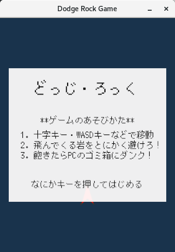
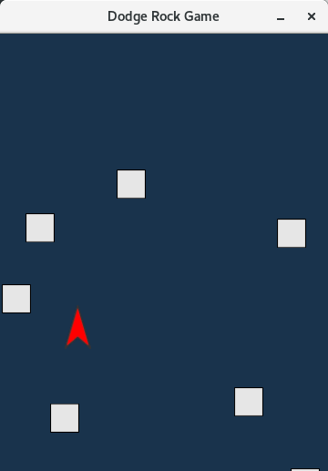

Dodge Rock
============

# これはなに？

シンプルにシンプルな習作ゲーム。

落ちてくる岩をひたすら避ける、それだけのゲームです。

# スクリーンショット






# ゲーム操作について

**キーボードでの操作**

* 十字キー、WASDキー、HJKLキーで移動
* 移動中にShiftキーで低速移動
* ゲームオーバー時にRでリスタート、Tでタイトル画面へ、Qで終了

一応ゲームパッドにも対応してます。

**ゲームパッドでの操作**

* 十字キー、左アナログスティックで移動
* R1, L1で低速移動

**おまけ要素**

* `-d`, `--debug`引数を付けて起動するとデバッグモード
* デバッグモードでは自機当たり判定を表示

## ゲームのビルド

制作環境はLinuxですが、環境依存の強いライブラリは使ってないので、他プラットフォームでも動くはず。

自分でビルドしたい人は、Rustの管理ツールとしておなじみのCargoを入れた状態で、適当にビルドしてください。

```
cargo run --release
```

# ライセンス表記

僕(dettalant)が制作した部分については[MITライセンス](https://opensource.org/licenses/mit-license.php)とします。

これはゲーム本体である`dodge_rock`に加えて、自作ライブラリである`range_checker`、あとはいくつかの画像も含まれています。

# 使用素材・ライブラリ

ゲーム内で使用している素材、ライブラリは以下のものになります。

|名称|説明|
|---|---|
|[ggez](https://github.com/ggez/ggez)|Rust言語製の低層ゲームエンジン。使いやすい。|
|[rand](https://github.com/rust-lang-nursery/rand)|Rust言語の乱数生成するアレ。|
|[serde](https://serde.rs/)|Rust言語のデータシリアライズするアレ。Toml crateと合わせて使用。|
|[toml-rs](https://github.com/alexcrichton/toml-rs)|Rust言語のTomlパーサー。serde crateと合わせて使用。|
|[M+ Bitmap font](http://jikasei.me/font/jf-dotfont/)|かっちょいいドットフォント。本家リンク先は[ここ](http://mplus-fonts.osdn.jp/mplus-bitmap-fonts/index.html)|

# 作成の上で参考にしたもの

特に参考にした（コードを真似る意味で）のはこちら。

|名称|参考部分|
|---|-------|
|[Rocket](https://github.com/aochagavia/rocket)|全体の`src`ファイル構造、機能の分け方その他を|
|[astroblasto.rs](https://github.com/ggez/ggez/blob/master/examples/astroblasto.rs)|ggezにおける処理の流れ・コマンド用法を|
|[プログラミング言語Rust](https://rust-lang-ja.github.io/the-rust-programming-language-ja/1.6/book/README.html)|Rust言語の基本から応用までの説明として|
|[Rust by Example](http://rust-lang-ja.org/rust-by-example/)|トレイト・ジェネリクス周りなどの詳細な使い方などを|

もちろん情報収集としては、他にもいっぱいのサイトを参考にさせていただきました。多謝。


